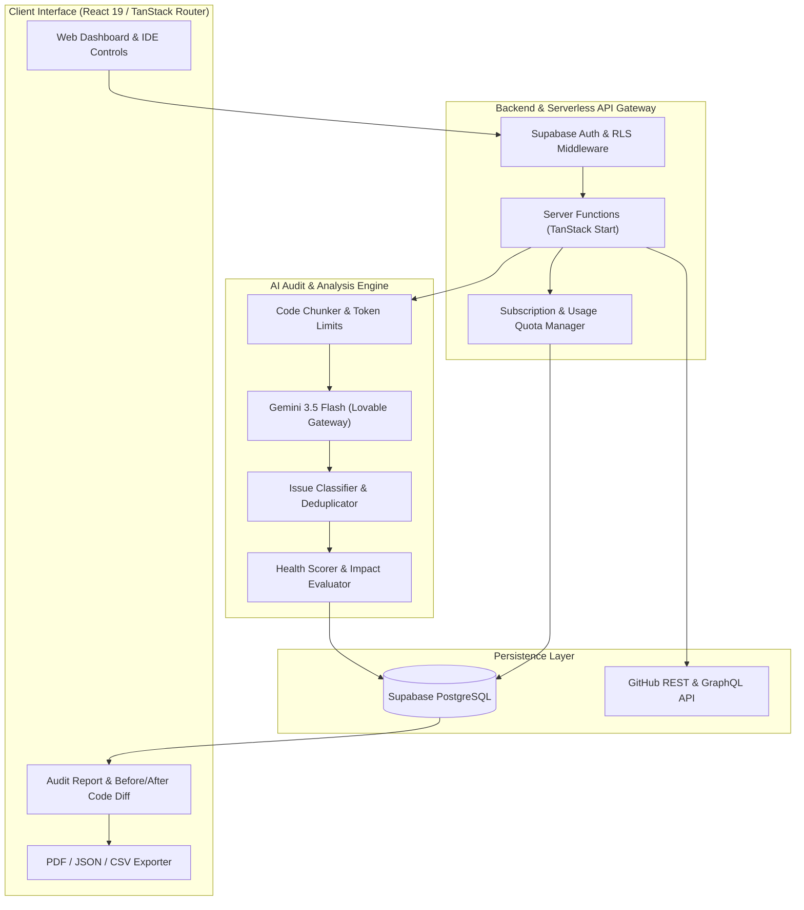

```mermaid
sequenceDiagram
    autonumber
    actor User as Engineer / VP Tech
    participant Client as Frontend Client
    participant Server as Server Function
    participant DB as Postgres Database
    participant AI as Gemini 3.5 Flash AI Engine

    User->>Client: Submit Code (Paste / Upload / GitHub Repo)
    Client->>Server: createAudit(payload)
    Server->>DB: Check & Consume Quota
    DB-->>Server: Quota Confirmed
    Server->>DB: Insert Audit (Status: 'processing')
    Server-->>Client: Return auditId
    Client->>Server: runAudit(auditId, files)

    rect rgb(15, 23, 42)
        Note over Server,AI: Asynchronous Code Analysis Cycle
        Server->>Server: chunkFiles(files, maxChars=24000)
        loop For Each File Chunk
            Server->>AI: analyseChunk(files, SYSTEM_PROMPT)
            AI-->>Server: Raw Scale Issues (JSON)
        end
        Server->>Server: dedupe(issues)
        Server->>Server: scoreHealth(counts) & verdictFor(counts)
    end

    Server->>DB: Insert Issues & Update Audit (Status: 'completed')
    Server-->>Client: Audit Results Complete
    Client->>User: Display Scale Health Score & Refactoring Fixes
```

# ⚡ ScaleCheck (Production Code Auditor)

### _Know your code is production-ready, before production._

<div align="center">

[](https://github.com/harshmriduhash/scalecheck)
[](#)
[](#)

**ScaleCheck** is the industry-leading AI developer platform built to detect and refactor code bottlenecks that break under high traffic loads. Paste code, upload files, or sync a GitHub repository to get an instant scale-readiness audit in under 2 minutes.

[Explore MVP Demo](#) • [Read Launch Checklist](file:///Users/harsh/Desktop/scalecheck/LAUNCH_CHECKLIST.md) • [View Production Guidelines](file:///Users/harsh/Desktop/scalecheck/PRODUCTION_CHECKLIST.md)

</div>

---

## 💡 What is ScaleCheck?

Traditional linters check for code style, and test suites check for basic functional correctness. But **neither can tell you if your system will hang, freeze, or crash when traffic spikes 10x or 100x.**

ScaleCheck acts as an automated **Senior Principal Architect** that inspects your application’s database queries, memory layouts, connection handling, and concurrency limits to catch scale-killers _before_ they impact your users.

---

## 🎯 Value Propositions by Persona

### 🛠️ For Developers & Tech Leads

> _"No more post-deployment debugging or pagerduty alerts at 3 AM."_

- **AST & LLM Semantic Engine:** Goes beyond simple regex. ScaleCheck builds a syntax graph of your files to find unclosed clients, unindexed queries, and loop database queries.
- **Instant Principal Architect Feedback:** Get before/after refactored code snippets directly in your CLI or dashboard, ready to copy-paste.

### 💼 For Founders & Entrepreneurs

> _"Ship code at startup speed without risking downtime, churn, or lost revenue."_

- **Protect the Bottom Line:** A single scale-related database lock can cost $100K+ in developer hours, user churn, and brand reputation. ScaleCheck intercepts these errors silently.
- **Unlock Engineering Velocity:** Remove manual architectural bottlenecks. Junior developers can audit their own code before PR submissions.

### 👔 For Recruiters & HR Professionals

> _"Validate the architectural skills of candidates instantly."_

- **Automated Assessment Tool:** Use ScaleCheck to screen take-home coding challenges. Instantly score a candidate’s scale competency (0-100 score) based on performance best practices rather than stylistic opinion.

---

## 💰 Quantifiable ROI (Time & Money Saved)

ScaleCheck pays for itself on day one. By catching performance regressions during development rather than in production:

| Impact Metric             | Before ScaleCheck          | With ScaleCheck | Financial / Time Savings                                         |
| :------------------------ | :------------------------- | :-------------- | :--------------------------------------------------------------- |
| **Major Scale Outages**   | 2 - 4 per year             | **0**           | **$100,000 – $500,000+** saved in lost revenue & SLA payouts     |
| **Architect Review Time** | 10+ hours / week           | **< 10 mins**   | **$40,000+** equivalent senior engineering salary saved annually |
| **Outage Debugging Time** | 20 - 40 hours per incident | **Instant fix** | Developers stay focused on shipping revenue-generating features  |

---

## 🏗️ System Design & Software Architecture

### High Level Design (HLD)

ScaleCheck is engineered with a modern, decoupled three-tier architecture:

1. **Frontend Presentation:** React 19 & TanStack Router for micro-interactions, responsive design, and local export capabilities.
2. **Serverless API Gateway:** TanStack Start server functions executing on Node.js, protected by Supabase Row-Level Security (RLS).
3. **AI Audit Engine:** Direct semantic parsing using Gemini 3.5 Flash via Lovable AI Gateway to generate high-fidelity refactoring models.



### Low Level Design (LLD) — The Audit Pipeline

The sequence below illustrates the live execution flow when an engineer submits their codebase for analysis:



---

## ⚡ Key MVP Features

- **Try with 1-Click:** Hit the "Try 1-Click Sample Audit" banner to test-drive the parser on a preloaded vulnerable codebase.
- **Detects 25+ Scale Bottlenecks:** Checks connection pools, N+1 iterations, database indexing, memory leaks, unhandled exceptions, SQL injections, and CPU-blocking operations.
- **Weighted Scale Scoring (0-100):** Weighted risk algorithm outputs a clear health score and release verdict.
- **Direct Code Diffing:** View side-by-side comparative views (`Before` vs `After`) with recommended optimizations.
- **Seamless Exports:** Instantly export reports to **PDF (Print Optimized)**, **JSON**, or **CSV** formats for team distribution.
- **Cryptographic Share Links:** Share read-only audit summaries securely with external teams via secure link tokens (`/share/$token`).

---

## 🛠️ Development Roadmap

### ✅ Phase 1: MVP Core (Released)

- [x] Multi-source code analysis (Raw paste text, multiple file uploads, GitHub repository connect).
- [x] Full Scale Audit Engine powered by Gemini 3.5 Flash semantic analysis.
- [x] Comparative code refactoring diff viewer.
- [x] Quota-enforced subscriptions (Free vs Pro).
- [x] PDF, JSON, and CSV data export controls.
- [x] Standard operational checklists: [LAUNCH](file:///Users/harsh/Desktop/scalecheck/LAUNCH_CHECKLIST.md), [PRODUCTION](file:///Users/harsh/Desktop/scalecheck/PRODUCTION_CHECKLIST.md), [EXECUTION](file:///Users/harsh/Desktop/scalecheck/EXECUTION_CHECKLIST.md), [MVP](file:///Users/harsh/Desktop/scalecheck/MVP_LAUNCH_CHECKLIST.md), [READY](file:///Users/harsh/Desktop/scalecheck/READY_CHECKLIST.md).

### ⏳ Phase 2: V1 Enhancements (Next Sprint)

- [ ] Language support expansion for Ruby, PHP, Rust, and C#.
- [ ] Active SQL DDL database schema relationship analysis.
- [ ] Slack & Discord instant notifications on high-severity findings.
- [ ] Interactive audit timeline and regression monitoring charts.

### 🔮 Phase 3: V2 Scale Integrations (Future Pipeline)

- [ ] Native GitHub Actions & GitLab CI/CD integration to block PR merges on Critical issues.
- [ ] Enterprise Custom Rule-engine for internal performance guidelines.
- [ ] Automated SOC2, GDPR, and security policy export compliance.

---

## 🚀 Quick Start & Installation

### Prerequisites

- Node.js >= 18.x
- NPM (or equivalent package manager)

### Installation

1. **Clone & Navigate:**

   ```bash
   git clone https://github.com/scalecheck/scalecheck.git
   cd scalecheck
   ```

2. **Install node modules:**

   ```bash
   npm install
   ```

3. **Configure Environment (`.env`):**

   ```env
   VITE_SUPABASE_URL="YOUR_SUPABASE_URL"
   VITE_SUPABASE_ANON_KEY="YOUR_SUPABASE_ANON_KEY"
   SUPABASE_SERVICE_ROLE_KEY="YOUR_SUPABASE_SERVICE_ROLE_KEY"
   LOVABLE_API_KEY="YOUR_GEMINI_AI_GATEWAY_KEY"
   ```

4. **Launch Development Server:**

   ```bash
   npm run dev
   ```

5. **Build Production Bundle:**
   ```bash
   npm run build
   ```

---

## ✉️ Contact & Enterprise Licensing

For team trials or enterprise deployment inquiries, please reach out to the founders at `harsh@scalecheck.dev`. Built for high-growth tech firms scaling systems to millions of users.
