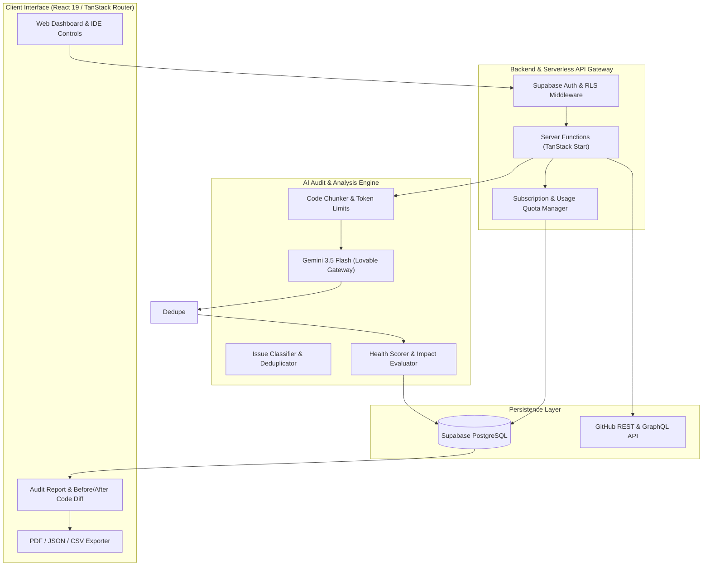

# Production Code Auditor — ScaleCheck

> **"Know your code is production-ready before production."**  
> _The AI-Powered Scale Readiness Platform for Modern Engineering Teams._


---

## Executive Summary

**Production Code Auditor (ScaleCheck)** is the pioneer AI platform built specifically to detect code patterns that break under 10x-100x traffic scale—N+1 database queries, missing indexes, unhandled connection pool leaks, memory leaks, blocking synchronous operations, and security vulnerabilities—**before they reach production**.

While traditional code review tools focus on syntax style or basic unit testing, ScaleCheck acts as an automated Senior Principal Architect inspecting system resilience, throughput bottlenecks, and scale-readiness in under 2 minutes.

---

## The Problem & Financial Impact

### The Problem

1. **Silent Scale Killers:** Code that passes test suites at 100 queries/day explodes into database locks and thread starvation at 100,000 queries/day.
2. **Senior Engineering Bottleneck:** Senior architects spend 30%+ of their time doing manual scale code reviews, slowing down product releases.
3. **Expensive Production Firefighting:** Outages are discovered post-deploy when customers experience downtime.

### Time & Money Saved

- 💰 **Direct Financial Savings:** Prevents scale outages costing **$100,000 to $500,000+** in lost revenue, SLA violations, and customer churn per incident.
- ⏱️ **Engineering Time Saved:** Reduces post-incident debugging time by **20 to 40+ hours per sprint**, freeing senior engineers to build core features.
- 🚀 **100x ROI:** At $199/month, preventing just **one** minor scale incident delivers over **100x immediate financial return**.

---

## High Level Architecture (HLD)

The system leverages a modern decoupled architecture with client-side Next.js/TanStack rendering, serverless API state management via Supabase Postgres & Row-Level Security, and an asynchronous AI analysis engine running on Gemini 3.5 Flash via Lovable AI Gateway.



---

## Low Level Design (LLD) — Audit Pipeline

```mermaid
sequenceDiagram
    autonumber
    actor User as Engineer / VP Tech
    participant Client as Frontend Client
    participant Server as Server Function
    participant DB as Postgres Database
    participant AI as Gemini 3.5 Flash AI Engine

    User->>Client: Submit Code (Paste / Upload / GitHub Repo)
    Client->>Server: createAudit(payload)
    Server->>DB: Check & Consume Quota
    DB-->>Server: Quota Confirmed
    Server->>DB: Insert Audit (Status: 'processing')
    Server-->>Client: Return auditId
    Client->>Server: runAudit(auditId, files)

    rect rgb(15, 23, 42)
        Note over Server,AI: Asynchronous Code Analysis Cycle
        Server->>Server: chunkFiles(files, maxChars=24000)
        loop For Each File Chunk
            Server->>AI: analyseChunk(files, SYSTEM_PROMPT)
            AI-->>Server: Raw Scale Issues (JSON)
        end
        Server->>Server: dedupe(issues)
        Server->>Server: scoreHealth(counts) & verdictFor(counts)
    end

    Server->>DB: Insert Issues & Update Audit (Status: 'completed')
    Server-->>Client: Audit Results Complete
    Client->>User: Display Scale Health Score & Refactoring Fixes
```



---

## Key Features (MVP)

- ⚡ **1-Click Sample Audit:** Test drive the engine instantly with built-in vulnerable microservice code.
- 🔍 **25+ Scale Issue Patterns:** Detects N+1 loops, connection pool exhaustion, missing DB indexes, memory leaks, unhandled async exceptions, and security flaws.
- 📊 **Scale Readiness Score (0-100):** Weighted algorithm calculating overall risk index and clear release verdicts.
- 💡 **Concrete Code Refactoring:** Shows exact file locations, lines, and before/after code fixes.
- 📄 **Multi-Format Reports:** Export reports in PDF (print-optimized), JSON format, and CSV spreadsheet summaries.
- 🔗 **Cryptographic Share Links:** Share public audit results with external stakeholders safely (`/share/$token`).
- 🔐 **Enterprise Security & RLS:** End-to-end Row-Level Security ensuring code privacy and zero plain-text retention.

---

## Development Roadmap

### ✅ Phase 1: MVP Core (Completed)

- [x] Multi-source ingestion (Paste code, upload files, GitHub repo OAuth/PAT sync).
- [x] Full AI analysis engine detecting 25+ scale killers.
- [x] Health score calculator (0-100) and severity classification.
- [x] Interactive code refactoring diff viewer (before/after).
- [x] PDF, JSON, and CSV report exports.
- [x] 1-Click test audit with pre-loaded vulnerable codebase.
- [x] Launch & Production Checklists (`LAUNCH_CHECKLIST.md`, `PRODUCTION_CHECKLIST.md`, `EXECUTION_CHECKLIST.md`, `MVP_LAUNCH_CHECKLIST.md`, `READY_CHECKLIST.md`).

### ⏳ Phase 2: V1 Enhancements (Pending Next Sprint)

- [ ] Support for Ruby, PHP, Rust, and C#.
- [ ] Database Schema SQL DDL analyzer.
- [ ] Automated Slack & Discord webhook alerts.
- [ ] Audit history trend analytics and score progression over time.

### 🔮 Phase 3: V2 Platform Growth (Future Roadmap)

- [ ] GitHub Actions & GitLab CI/CD auto-audits on Pull Requests.
- [ ] Custom enterprise rule builder.
- [ ] SOC2 & GDPR compliance reporting export.

---

## Quick Start & Local Setup

### Prerequisites

- Node.js >= 18.x
- Bun or NPM

### Installation

1. **Clone the repository:**

   ```bash
   git clone https://github.com/scalecheck/scalecheck.git
   cd scalecheck
   ```

2. **Install dependencies:**

   ```bash
   npm install
   ```

3. **Configure Environment Variables (`.env`):**

   ```env
   VITE_SUPABASE_URL="YOUR_SUPABASE_URL"
   VITE_SUPABASE_ANON_KEY="YOUR_SUPABASE_ANON_KEY"
   SUPABASE_SERVICE_ROLE_KEY="YOUR_SUPABASE_SERVICE_ROLE_KEY"
   LOVABLE_API_KEY="YOUR_GEMINI_AI_GATEWAY_KEY"
   ```

4. **Launch Development Server:**

   ```bash
   npm run dev
   ```

5. **Build for Production:**
   ```bash
   npm run build
   ```

---

## Contact & License

Developed with ❤️ for high-growth engineering teams.  
For enterprise inquiries, reach out to `harsh@scalecheck.dev`.
